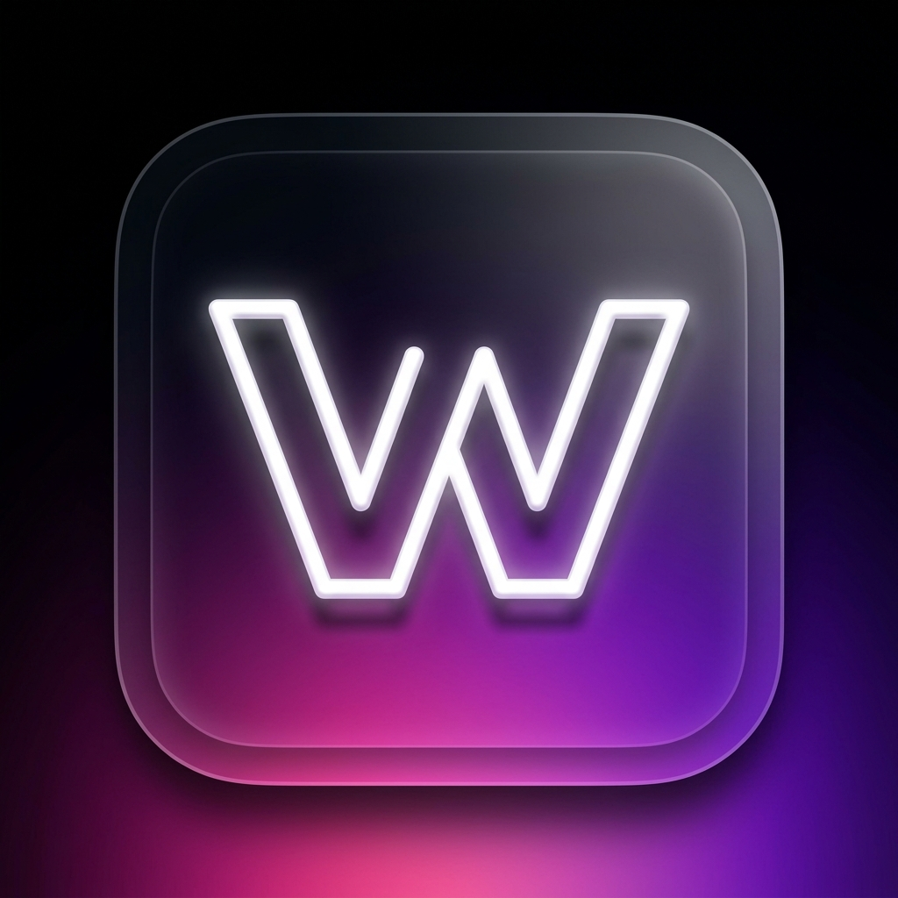

# 📱 WOOM (What's On Our Minds)

<div align="center">
  
</div>

*[🇬🇧 English](#english) | [🇹🇷 Türkçe](#turkce)*

---

<a id="english"></a>
## 🇬🇧 English

**WOOM** is a beautifully designed, Progressive Web Application (PWA) built to mimic a native iOS experience. It serves as a personal, shared timeline for tracking books, movies, TV series, and photos.

### ✨ Key Features
- **Native iOS Aesthetic:** Pixel-perfect Cupertino design, including Apple-style Segmented Controls, Bottom Sheet modals, and glassmorphism (translucent blurred overlays) with a glowing Neon Dark Mode theme.
- **Progressive Web App (PWA):** Can be installed directly to the home screen (iOS Safari & Android) to be used exactly like a native standalone app without browser chrome.
- **Real-Time Data:** Powered by **Firebase Firestore**, ensuring that everything added synchronizes instantly across users.
- **Smart Media Management:** Integrates directly with **Cloudinary** for image hosting. Includes a client-side Javascript compression algorithm to shrink image file sizes prior to API upload.
- **Dual Feed Architecture:** Custom feeds to view the overall timeline or filter by specific users.

### 🛠️ Tech Stack
- **Frontend Framework:** React 18, Vite.js
- **Styling:** Custom CSS (Focus on Apple UX, Dark Mode constraints)
- **BaaS (Backend as a Service):** Firebase Cloud Firestore
- **Media CDN:** Cloudinary REST API

### 🚀 Getting Started
```bash
# Install dependencies
npm install

# Start the development server
npm run dev
```
*Note: You must create a `.env` file containing your Firebase Config and Cloudinary API credentials.*

https://woom-one.vercel.app/

---

<a id="turkce"></a>
## 🇹🇷 Türkçe

**WOOM**, gerçek bir iPhone (iOS) uygulaması deneyimi sunmak üzere tasarlanmış bir Progressive Web Application (PWA) projesidir. İki kişi arasında kitap, film, dizi ve kişisel fotoğraflarını arşivlemek için kullanılan ortak bir dijital günlüktür.

### ✨ Temel Özellikler
- **Gerçekçi iOS Arayüzü:** Apple'a özgü Bottom Sheet (Alttan açılan ekran), Segmented Control (Üst tasarım sekmeleri), Blur (Bulanıklık efekti/Glassmorphism) ve mobil cihaz limitlerine uyumlu Dark/Neon Glow teması.
- **PWA (Progressive Web App):** Herhangi bir tarayıcıdan "Ana Ekrana Ekle" özelliğiyle indirilip gerçek bir mobil uygulama formatında (tarayıcı izi olmadan) tam ekran kullanılabilir.
- **Gerçek Zamanlı Veritabanı:** **Firebase Firestore** altyapısıyla içerikler iki kullanıcı için de anında senkronize olur.
- **Akıllı Medya Yönetimi:** Yüksek boyutlu fotoğraflar **Cloudinary** API ile güvenle buluta yüklenir. Yükleme öncesinde Javascript ile çalışan istemci taraflı **görsel sıkıştırma (compression) algoritması** sayesinde veri ve hız optimizasyonu yapılır.
- **Özelleştirilmiş Kullanıcı Akışları:** Hem "İkisi" olarak bilinen ortak zaman tüneli hem de detaylı bireysel akışlar ayrıştırılmıştır.

### 🛠️ Kullanılan Teknolojiler
- **Kullanıcı Arayüzü (Frontend):** React 18, Vite.js
- **Tasarım:** Vanilla CSS (Responsive PWA, Glassmorphism, Native Mobil Mimarisi)
- **Veritabanı (Backend):** Firebase Cloud Firestore
- **Medya Yönetimi (CDN):** Cloudinary API

### 🚀 Kurulum
```bash
# Gerekli paketleri yükleyin
npm install

# Geliştirici sunucusunu başlatın
npm run dev
```
*Not: Projeyi kendi cihazınızda çalıştırmak için ana dizinde Firebase ve Cloudinary servis anahtarlarınızı barındıran bir gizli `.env` dosyası oluşturmalısınız.*
https://woom-one.vercel.app/
